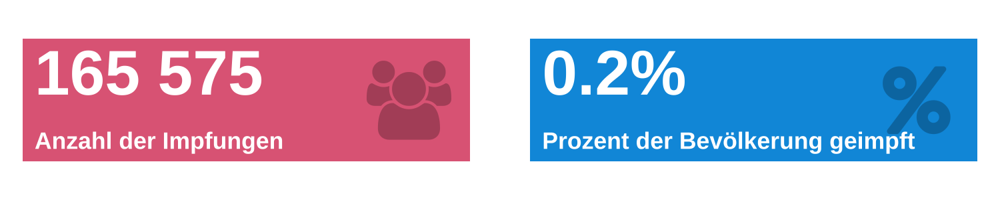

<!-- README.md is generated from README.Rmd. Please edit that file -->

```{r, include = FALSE}
knitr::opts_chunk$set(
  collapse = TRUE,
  comment = "#>"
)

```

# COVID-19 Impfungsdaten des RKI

Ziel dieses [Dashboards](https://favstats.github.io/vaccc19de_dashboard/) ist es den Fortschritt von COVID-19 Impfungen in Deutschland zu dokumentieren und visualisieren. 

Die Impfungsdaten werden täglich vom Robert-Koch-Institut (RKI) [auf dieser Seite](https://www.rki.de/DE/Content/InfAZ/N/Neuartiges_Coronavirus/Daten/Impfquoten-Tab.html) bereitgestellt. Die hier dargestellten Daten wurden mit Hilfe des R packages [vaccc19de](https://github.com/friep/vaccc19de) aufbereitet und können [hier](https://github.com/friep/vaccc19de_rki_data) heruntergeladen werden.

Bevölkerungsdaten für die Bundesländer stammen vom [Statistischen Bundesamt](https://www.destatis.de/DE/Themen/Gesellschaft-Umwelt/Bevoelkerung/Bevoelkerungsstand/Tabellen/bevoelkerung-nichtdeutsch-laender.html).





