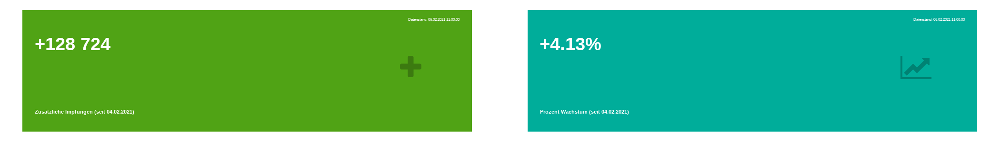

<!-- README.md is generated from README.Rmd. Please edit that file -->

```{r, include = FALSE}
knitr::opts_chunk$set(
  collapse = TRUE,
  comment = "#>"
)

```

# COVID-19 Impfungsdaten des RKI

Ziel dieses [Dashboards](https://favstats.github.io/vaccc19de_dashboard/) ist es den Fortschritt von COVID-19 Impfungen in Deutschland zu dokumentieren und visualisieren. 

Die Impfungsdaten werden täglich vom Robert-Koch-Institut (RKI) [auf dieser Seite](https://www.rki.de/DE/Content/InfAZ/N/Neuartiges_Coronavirus/Daten/Impfquoten-Tab.html) bereitgestellt. Die hier dargestellten Daten wurden mit Hilfe des R packages [vaccc19de](https://github.com/friep/vaccc19de) aufbereitet und können [hier](https://github.com/friep/vaccc19de_rki_data) heruntergeladen werden.

Bevölkerungsdaten für die Bundesländer stammen vom [Statistischen Bundesamt](https://www.destatis.de/DE/Themen/Gesellschaft-Umwelt/Bevoelkerung/Bevoelkerungsstand/Tabellen/bevoelkerung-nichtdeutsch-laender.html).





# Data

**Disclaimer**: The following is in English because it was migrated from the [old data repository](https://github.com/friep/vaccc19de_rki_data) and we could not be bothered to translate it so far. 

Besides providing the dashboard, we collect and store the data behind the dashboard in this repository. Data is published by the RKI on [this page](https://www.rki.de/DE/Content/InfAZ/N/Neuartiges_Coronavirus/Daten/Impfquotenmonitoring.html). 

The data is collected via a GitHub Action which uses the accompanying [{vaccc19de} R :package:](https://github.com/friep/vaccc19de). You can find the raw data (xlsx files and sheets as csvs) in `data/raw` and the time series at `data/cumulative_time_series.csv`.   

## Data License
We are currently figuring out how to license the data / whether there are any restrictions from RKI's side - we don't suspect that there are any but we haven't found any information on that yet.

:warning: I take no liability for the correctness of the data! :warning: 

## Datasets

### `data/cumulative_time_series.csv`

### Disclaimers :warning:

- All counts are cumulative (except `differenz_zum_vortag`)
- timestamps in the csv are in UTC, not in Berlin time. 
- as stated in the raw xlsx file, one vaccinated person can have multiple indications: "Anmerkung zu den Indikationen: Es können mehrere Indikationen je geimpfter Person vorliegen."
- always check the raw xlsx (see folder `data/raw`)

Read in directly from GitHub using R:
```{r eval=FALSE, echo=TRUE, message=FALSE}
cumulative_ts <- readr::read_csv("https://raw.githubusercontent.com/favstats/vaccc19de_dashboard/main/data/cumulative_time_series.csv")
```

```{r echo=FALSE, message=FALSE}
data <- readr::read_csv("data/cumulative_time_series.csv")
cnames <- colnames(data)
df <- tibble::tribble(
    ~type, ~description,
    "datetime", "datetime until which data is included ('Datenstand') as specified in the Excel file. Given in UTC",
    "datetime", "datetime when data was downloaded from RKI website. Given in UTC",
    "character", "full name of Bundesland", 
    "character", "ISO 3166-2 of Bundesland",
    "double", "Cumulative total number of vaccinations in the Bundesland",
    "double", "Difference to previous day (~roughly corresponds to people vaccinated since then although delays in reporting could be the case",
    "double", "Total number of people vaccinated because of their age so far (cumulative)",
    "double", "Total number of people vaccinated because of their profession so far (cumulative)",
    "double", "Total number of people vaccinated because of medical reasons so far (cumulative)",
    "double", "Total number of people in nursing homes so far (cumulative)",
    "character", "Notes as indicated by * in the Excel sheet.",
    "character", "additional comments (we're working on merging those with the notes)"
)
df$col <- cnames
knitr::kable(dplyr::select(df, col, type, description))
```


# Contribute
Contributions are very welcome. Depending on where you want to add features, please open an issue here or on [{vaccc19de}](https://github.com/friep/vaccc19de):

- features relating to GitHub Action and daily updates of the data --> this repository
- features relating to the dashboard --> this repository
- features relating to data wrangling, data cleaning of the original excel file --> [{vaccc19de}](https://github.com/friep/vaccc19de)

Of course, features might require changes in both repositories. Please still open issues in both repositories and then link them to each other. 

