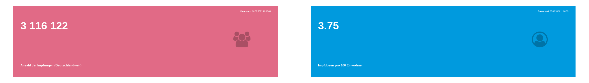

<!-- README.md is generated from README.Rmd. Please edit that file -->

```{r, include = FALSE}
knitr::opts_chunk$set(
  collapse = TRUE,
  comment = "#>"
)

```

# COVID-19 Impfungsdaten des RKI

Ziel dieses Repository ist es den Fortschritt von COVID-19 Impfungen in Deutschland zu [dokumentieren](https://github.com/favstats/vaccc19de_dashboard/data/) und [visualisieren](https://favstats.github.io/vaccc19de_dashboard/).

Die Impfungsdaten werden täglich vom Robert-Koch-Institut (RKI) [auf dieser Seite](https://www.rki.de/DE/Content/InfAZ/N/Neuartiges_Coronavirus/Daten/Impfquoten-Tab.html) bereitgestellt.  Die hier dargestellten Daten werden von diesem öffentlichen [ARD Data GitHub repository](https://github.com/ard-data/2020-rki-impf-archive){target="_blank"} bezogen. 

Bevölkerungsdaten für die Bundesländer stammen vom [Statistischen Bundesamt](https://www.destatis.de/DE/Themen/Gesellschaft-Umwelt/Bevoelkerung/Bevoelkerungsstand/Tabellen/bevoelkerung-nichtdeutsch-laender.html).

`r emojifont::emoji("memo")` Hinweis: Das RKI hat am 18.01.2021 angefangen, in seinen Daten nach erster und zweiter Impfung sowie nach Impfstoff (Moderna und Biontech) zu unterscheiden. Dies resultierte in einigen Veränderungen in der Struktur der Excel-Datei (z.B. mehr Spalten, mehrzeilige Spaltennamen), die zwar für das menschliche Auge gut und schnell zu verarbeiten sind, aber für den Code, den wir geschrieben haben, um das Excel einzulesen und in ein einheitlicheres Format zu bringen, Probleme darstellen. Seit dem 24.01.2021 beziehen wir nun die Impfdaten von diesem öffentlichen [GitHub repository von ARD Data](https://github.com/ard-data/2020-rki-impf-archive) `r emojifont::emoji("memo")`




```{r echo=FALSE, message=FALSE, warning = FALSE}
library(tidyverse)

data <- readr::read_csv("data/cumulative_time_series.csv")


data <- readRDS(rki_dat, file = "data/rki_dat.RDS")

latest_dat <- data %>% 
  filter(publication_date == max(publication_date)) %>% 
  mutate(notes = NA)

datenstand <- unique(latest_dat$publication_date) %>%  
  lubridate::with_tz(tz = "Europe/Berlin") %>% 
  format("%d.%m.%Y %H:%M:%S")
```

<center>

*Letzter Datenstand: `r datenstand`*

<!-- **Aktuelle Anmerkungen:** -->

<!-- ```{r, results = "asis", echo = F} -->


<!-- notes_dat <- latest_dat %>%  -->
<!--   drop_na(notes) -->


<!-- if(nrow(notes_dat)!=0){ -->
<!--   notes_dat %>%  -->
<!--     mutate(notes = ifelse(stringi::stri_startswith_fixed(notes, "("), -->
<!--                           str_remove(notes, "\\("), -->
<!--                           notes), -->
<!--            notes = ifelse(stringi::stri_endswith_fixed(notes, ")") , -->
<!--                           str_sub(notes, 1, str_length(notes)-1), -->
<!--                           notes), -->
<!--            notes = ifelse(!stringi::stri_endswith_fixed(notes, "\\.") , -->
<!--                           paste0(notes, "."), -->
<!--                           notes)) %>%  -->
<!--     mutate(note_display = glue::glue("{bundesland}: *{notes}*")) %>%  -->
<!--     pull(note_display) %>%  -->
<!--     paste0(collapse = "\n\n")  %>%  -->
<!--     cat() -->
<!-- } else { -->
<!--   cat("*Keine Anmerkungen.*") -->
<!-- } -->


<!-- ``` -->

Twitter Bot für tägliche Updates: [vaccc19de](https://twitter.com/vaccc19de){target="_blank"}

</center>

# Contribute

Contributions are very welcome. Depending on where you want to add features, please open an issue here or on [{vaccc19de}](https://github.com/friep/vaccc19de){target="_blank"}:

- features relating to GitHub Action and daily updates of the data --> this repository
- features relating to the dashboard --> this repository
- features relating to data wrangling, data cleaning of the original excel file --> [{vaccc19de}](https://github.com/friep/vaccc19de){target="_blank"}

Of course, features might require changes in both repositories. Please still open issues in both repositories and then link them to each other. 

